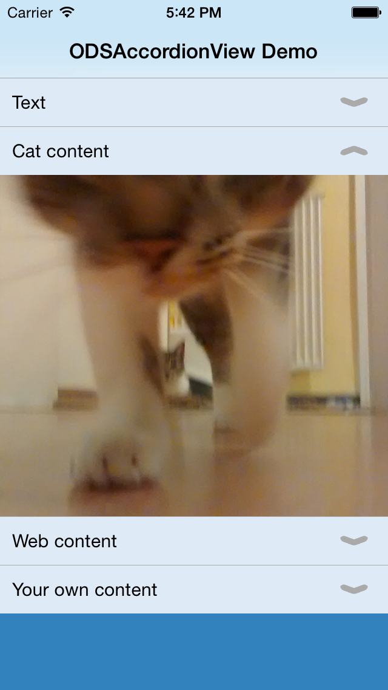

# ODSAccordionView

Yet another accordion style container view

* Made for iOS 7+.
* Flat design
* Autolayout compatible
* Uses ARC

## Screenshots

 . 

## Usage

To run the example project, clone the repo, and run `pod install` from the Example directory first.

## Requirements

Requires iOS 7 or above

## Installation

ODSAccordionView is available through [CocoaPods](http://cocoapods.org). To install
it, simply add the following line to your Podfile:

    pod "ODSAccordionView"

## Author

Johannes Seitz, http://www.craftware.de 

## License

ODSAccordionView is available under the MIT license. See the LICENSE file for more info.

